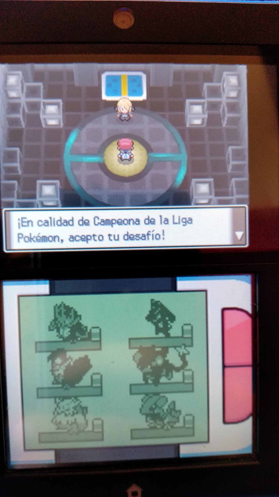
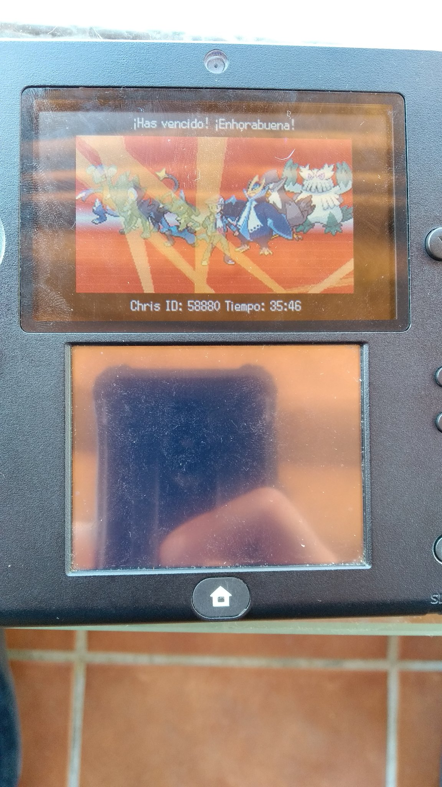
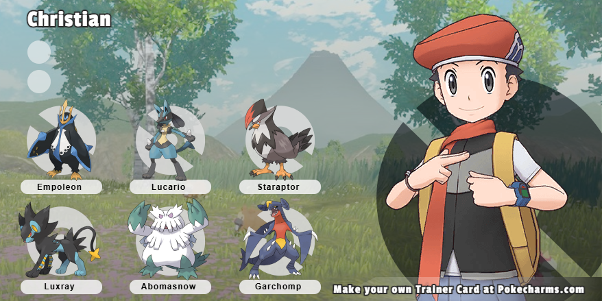

Un juego muy completo. Mejora muchísimo a las entregas base, haciendo el juego más ágil y mejorando algunos aspectos que flojeaban. La nostalgia me ciega, pero es un juego jodidamente precioso.

He encontrado un [tuit](https://x.com/christt105/status/1247131517610070017) en el que publiqué el Hall of Fame con una foto directamente a la 2DS. Algo recuerdo, pero no mucho. Menos el Abomasnow, los demás son literalmente equipo heteronormativo.

 !

