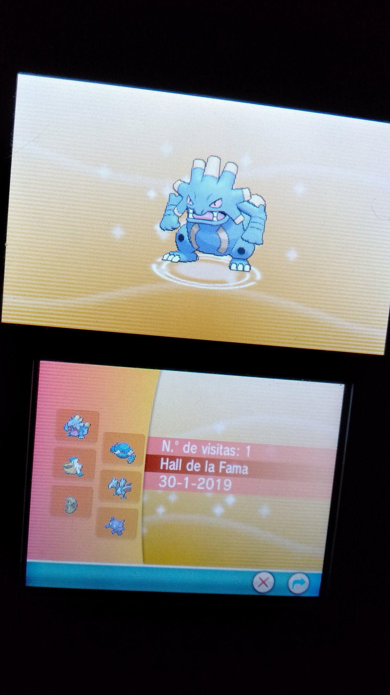

Lo compré junto a la 2DS y, aunque no recuerdo cuando me lo pasé, lo debí completar no mucho después de comprarla.

Un buen remake, bastante bonito y me hizo recordar jugando al rubí cuando era pequeño.

## 2019-01-30
No recuerdo de cuando es esta imagen, ni del equipo, ni de si era del Rubí o del Zafiro, pero estaba en Twitter, así que la guardo en mi vault. Por lo que veo en el equipo debió de ser alguna especie de reto eligiendo Pokémon que no suelo usar, porque el equipo es bastante raruno.
