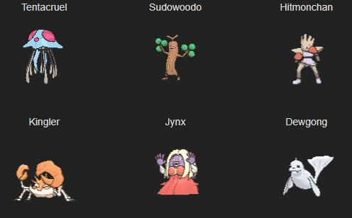
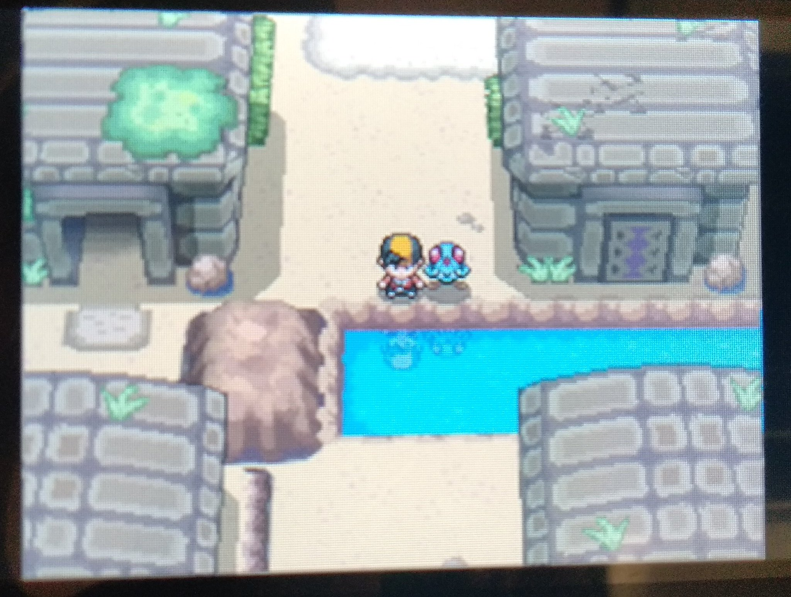

Me lo pasé con un equipo predefinido desde antes de empezar la aventura.

Hall of Fame: 2020-05-21

Tuve un Tentacool de inicial y recuerdo vencer a Rojo. No tengo captura del Hall of Fame, solo unas cuantas fotos hechas con el móvil a la 2DS.

Nunca lo jugué de pequeño, me desenganché de la saga en el Diamante y nunca me llamó este juego, pero es jodidamente preciosos, probablemente los juegos de Pokémon que más me gustan artísticamente. Me pone triste ver lo que eran capaces de hacer antes, y los productos que nos dan ahora.